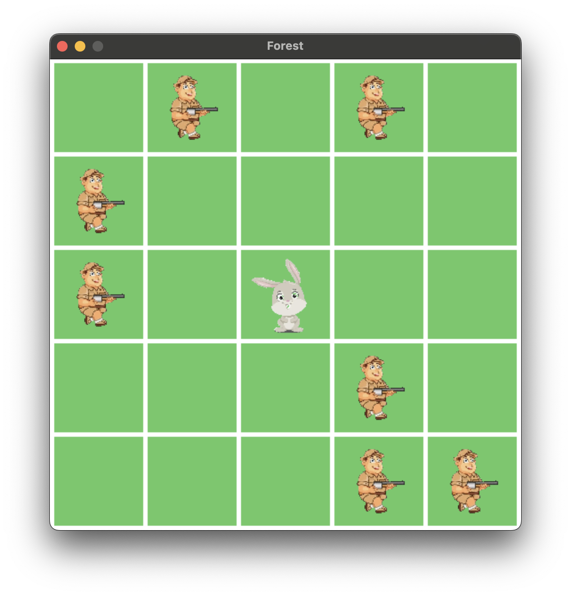

# Run Bunny

A project for search problems.
The game consists a bunny which is about to be trapped by hunters. Bunny can jump to neighbouring locations. New hunters appear and encircle the bunny. Bunny wins if it can reach the edge of the hunting ground. Hunters win if they trap the bunny.

## Images
Below are some of the game assets:

 

## Parameters of Forest Class:

`size`: the size of the grid

`hunters`: number of hunters to spawn at the start

`intelligent`: best hunter move using manhattan distance heuristic

`render`: If the game will be rendered.

## Play the game
If you want to play the game, use `render=True`. 

Then use arrow keys to move the bunny. 

Use 'R' key to reset the game.

For an example use `runbunny.py`

## Let the agent play the game

If you want an agent to play the game use `render=False`. 

Use API to interact with the game.

For an example use `runbunny_agent.py`

## State space:

A dictionary consisting locations of hunters and bunny.

a location is a list consisting x and y coordinates on the grid

hunters is a list consisting n hunter locations

bunny is the location of the bunny

## Action space:
`["UP","DOWN","RIGHT","LEFT"]`

If an invalid action requested either by keyboard or function action, game does not respond.

## Winner:

getWinner function returns following:

`-1` : Hunters win

`0` : Game is not yet concluded, action required
 
`1` : Bunny wins 
